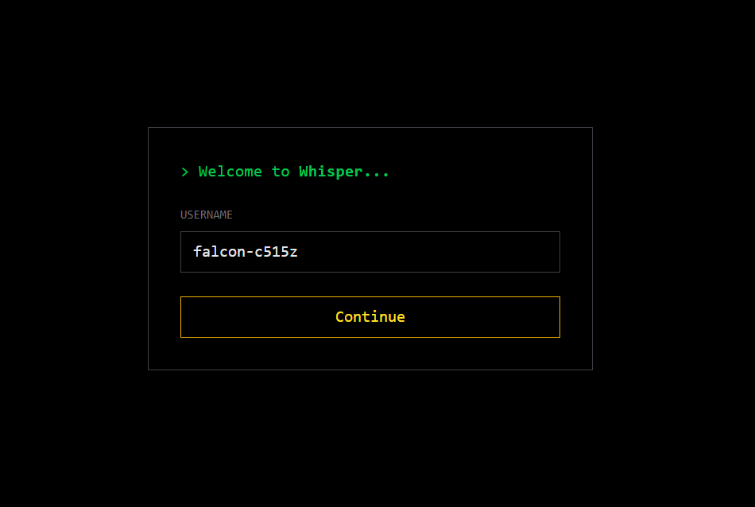

# Whisper

A Real-time chat app built with **React + Node + Socket.IO**.

## Preview

<p align="center">
  
</p>


---

## ⚡ Features

* Real-time chat using Socket.IO
* Temporary chat rooms
* Room expiration timer
* Destroy room option

---

## 🧱 Tech Stack

* React (Vite)
* JavaScript
* Tailwind CSS
* Node.js
* Socket.IO

---

## 🚀 Run Locally

### Backend

```bash
cd server
npm install
node index.js
```

### Frontend

```bash
cd client
npm install
npm run dev
```

---

## 🖤 Philosophy

Minimal. Temporary. Private.
Nothing lasts — that’s the point.

---
